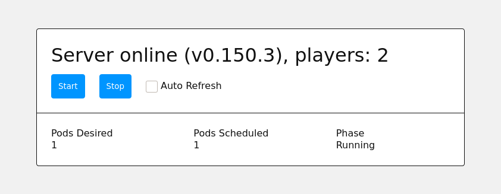

# @zeroindexed/valheimctl-worker

Web UI to query and scale [Valheim][valheim] over the Kubernetes API.

This [Cloudflare Workers][workers] script allows anyone in your friend group to start the Valheim server and start playing without having to invoke `kubectl`, `pulumi`, or do any cluster level operations.

Features:

-   A responsive bare bones 2 button UI.
-   Password protection via [HTTP basic authentication][basic-auth].
-   Automatic shutdown of the server if it is idle for a given amount of time.
-   Can run entirely on the [Cloudflare free tier][pricing].
-   A `?debug` URL parameter that displays raw data

## Related Work

-   [`@zeroindexed/valheimctl`][valheimctl]: a Pulumi package to deploy this worker.
-   https://valheimctl.zeroindexed.com is a real world deployment of this worker.

## Usage

Getting the Cloudflare environment configured to run this web UI is quite involved and complicated. Consider using [`@zeroindexed/valheimctl`][valheimctl], which will handle setting up the moving pieces.

---

This workers script is configured via [environment variables and workers KV bindings][env]:

[KV bindings][env-kv]:

-   `VALHEIMCTL_KV`: Required, a KV namespace to store logs and observations for idle shutdown.

[Environment variables][env-vars]:

-   `VALHEIMCTL_K8S_GATEWAY`: Required, the HTTPS gateway to talk to the [Kubernetes API server][kube-apiserver]. Cloudflare workers will validate that the certificate is signed by a trusted root CA, so a self signed certificate is not valid here ([`@zeroindexed/valheimctl`][valheimctl] uses a Cloudflare domain to terminate SSL and proxy to the apiserver using the [SSL `Full` option][cloudflare-ssl-full]).
-   `VALHEIMCTL_NAMESPACE`: Required, the Kubernetes namespace to find the stateful sets and pods.
-   `VALHEIMCTL_STATEFUL_SET_NAME`: Required, the name of the stateful set that toggles between `{replicas: 1}` and `{replicas: 0}` to start and stop the server.
-   `VALHEIMCTL_POD_NAME`: Required, the name of the pod that runs the [Valheim container][valheim-docker]. Since this pod is being managed by a stateful set, it should have a [deterministically generated name][kube-stateful-set-pod-id], but this is exposed as explicit configuration instead of baking those rules into the UI code.
-   `VALHEIMCTL_ODIN_NAME`: Required, the name of the service connecting to the [Odin HTTP service][odin].
-   `VALHEIMCTL_IDLE_SHUTDOWN_AFTER`: Optional, number of seconds to wait before turning off an idle server. Leaving this unspecified turns off the idle shutdown feature entirely. You must also configure [a cron trigger][cloudflare-cron] to periodically invoke the worker for the idle shutdown to actually work.
-   `VALHEIMCTL_IDLE_SHUTDOWN_LOG_TTL`: Optional, number of seconds that logging for the idle shutdown checks should live for. These logs are accessible via the `?debug` URL parameter. The idle shutdown routine is called somewhat frequently, so a short duration like an hour or so is usually okay.
-   `VALHEIMCTL_ACTOR_LOG_TTL`: Optional, number of seconds that IP address logging of `Start` and `Stop` actions should live for. These logs are accessible via the `?debug` URL parameter. Since these actions are relatively infrequent, something like a day or even a week is okay here.

[Secret variables][env-vars]:

-   `VALHEIMCTL_K8S_TOKEN`: Required, the [`ServiceAccount` token][kube-auth] to authenticate against the [Kubernetes API server][kube-apiserver]. This `ServiceAccount` should have the following permissions:

    -   `{apiGroups: [""], verbs: ["get"], resources: ["services/proxy"], resourceNames: ["..."]}` where `"..."` is the name of the service specified by `VALHEIMCTL_ODIN_NAME`. This allows the UI to query the [Odin HTTP service][odin] for server status and player count by [proxying the request over the Kubernetes API server][kube-proxy].
    -   `{apiGroups: [""], verbs: ["get"], resources: ["pods"], resourceNames: ["..."]}` where `"..."` is the name of the pod specified by `VALHEIMCTL_POD_NAME`. This allows the UI to query pod state to see if it's pending or scheduled or running.
    -   `{apiGroups: ["apps"], verbs: ["get"], resources: ["statefulsets"], resourceNames: ["..."]}` where `"..."` is the name of the stateful set specified by `VALHEIMCTL_STATEFUL_SET_NAME`. This allows the UI to query the desired and current number of replicas.
    -   `{apiGroups: ["apps"], verbs: ["patch"], resources: ["statefulsets/scale"], resourceNames: ["..."]}` where `"..."` is the name of the stateful set specified by `VALHEIMCTL_STATEFUL_SET_NAME`. This allows the UI start and stop buttons to scale the stateful set and thus actually start and stop the pod.

- `VALHEIMCTL_PASSWORD`: Optional, but highly recommended. If specified, the web interface will demand a password using [HTTP basic authentication][basic-auth] (the username does not matter). If left unspecified, anyone with the URL can manipulate your cluster state!

[valheimctl]: ../valheimctl
[basic-auth]: https://en.wikipedia.org/wiki/Basic_access_authentication
[valheim]: https://www.valheimgame.com/
[valheim-docker]: https://github.com/mbround18/valheim-docker
[odin]: https://github.com/mbround18/valheim-docker/blob/main/docs/releases/status_update.md#-http-server-for-serving-status
[kube-auth]: https://kubernetes.io/docs/reference/access-authn-authz/authentication/#service-account-tokens
[kube-apiserver]: https://kubernetes.io/docs/concepts/overview/components/#kube-apiserver
[kube-permissions]: https://kubernetes.io/docs/reference/access-authn-authz/rbac/
[kube-proxy]: https://kubernetes.io/docs/tasks/access-application-cluster/access-cluster/#manually-constructing-apiserver-proxy-urls
[kube-stateful-set-pod-id]: https://kubernetes.io/docs/concepts/workloads/controllers/statefulset/#pod-identity
[workers]: https://developers.cloudflare.com/workers/
[env]: https://developers.cloudflare.com/workers/platform/environments#environment-variables
[env-vars]: https://developers.cloudflare.com/workers/cli-wrangler/configuration#vars
[env-kv]: https://developers.cloudflare.com/workers/cli-wrangler/configuration#kv_namespaces
[pricing]: https://developers.cloudflare.com/workers/platform/limits
[cloudflare-ssl-full]: https://support.cloudflare.com/hc/en-us/articles/200170416-End-to-end-HTTPS-with-Cloudflare-Part-3-SSL-options#h_845b3d60-9a03-4db0-8de6-20edc5b11057
[cloudflare-cron]: https://developers.cloudflare.com/workers/platform/cron-triggers
